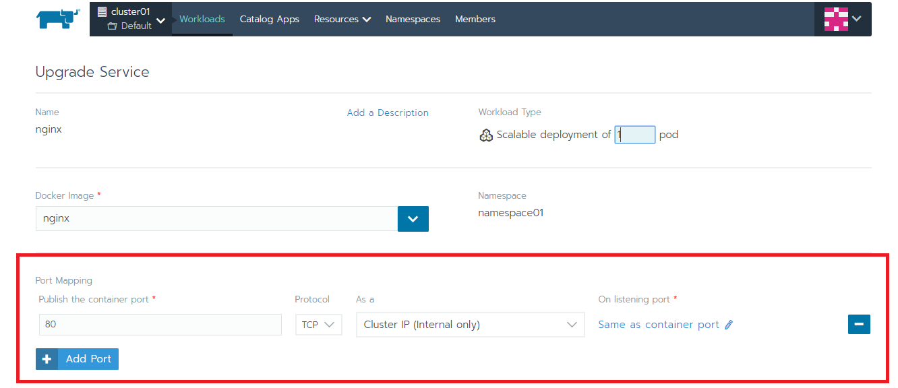
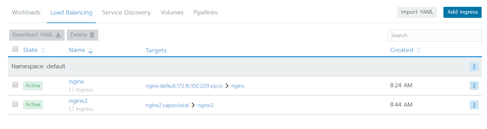
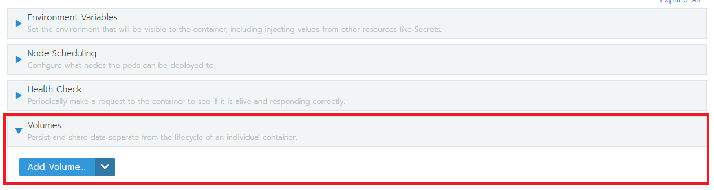

# 詳細部署設定

## Access to Container

### 1. NodePort

#### 設定 NodePort 可以讓你從你的電腦連線到 Container

在建立 Container 的時候指定，或編輯 Port 欄位

| Container Port | Protocol | Type | Port on Node |
| :--- | :--- | :--- | :--- |
| Container 上的 Port | TCP or UDP | NodePort | 對外 Port |

完成後，回到 Workloads 頁面，會看到底下的 `30189/TCP` 點它後，跳出的新網頁，網址列上的 ip: port 就可以連到 Container 上

### 2. Ingress

#### 設定 Domain name 


只支援 HTTP\(S\) 協定


#### 到左上角 Cluster:xxx -&gt; Project:xxx 右邊的 Workloads 下方的 Load Balancing 

按右上角 `Add Ingress`

設定 Name, 所屬 Namespace, Rules 選第一個 `Automatically generate`Target 選要對應到的 workloads 和 container port


也可以自己指定 Domain name \(需自行設定 hosts 對應到任一個 node 的 ip\)


透過生成的 Domain name 可以連到網頁上

## Volume 設定

#### 若要保存資料，需要掛上 NFS 的 Persistent Volume 

到 Workloads 找到要掛 volume 的 Container 按右邊三的點 -&gt; Edit

新增 volume \(Add volume... -&gt; Add a persistent volume\)

設定位置、空間大小、_**Storage Class**_、Access Mode 完成後，按 Define


Source 選 Use a Storage Class to provision a new persistent volume ，右邊 Storage Class 選任一個，按 Define


指定 Mount Path \( volume 在 Container 中的目錄位置\)

最後 Update ，狀態變為 Avtice 就完成了

資料夾在 NFS Server 上的命名規則為 "`<namespace>-<Volume Name>-pvc-xxxxxxxxxxxx`"    
這裡的例子會是 "`namespace02-vol01-pvc-xxxxxxxxxxxxx`" 可以在 NFS Server 設定的 Share directory 下找到這個資料夾

## Bind device

#### 把 Host 上的 /dev 目錄，底下的 device bind 到 Container 中

到 Workloads 找到要掛 device 的 Application 按右邊三的點-&gt; Edit

按右下角 `show advance options`，找到 `Security & Host Config` 把 `Privileged` 選 yes

接著新增一個 Volume \(Add volume... -&gt; Bind mount a directory from the nodes\)

設定名稱、node 上的 device 路徑\(Path on the node\)、container 上的路徑 \(Mount Path\)

完成後按最下面的 Upgrade，就完成了，可以到 container 底下找到 device

